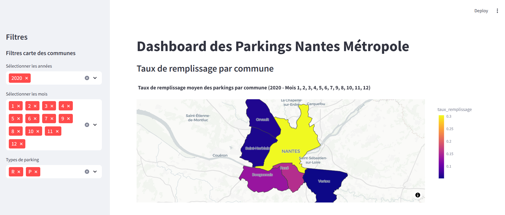
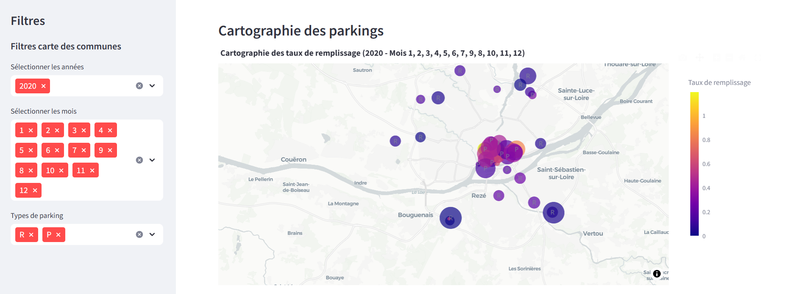
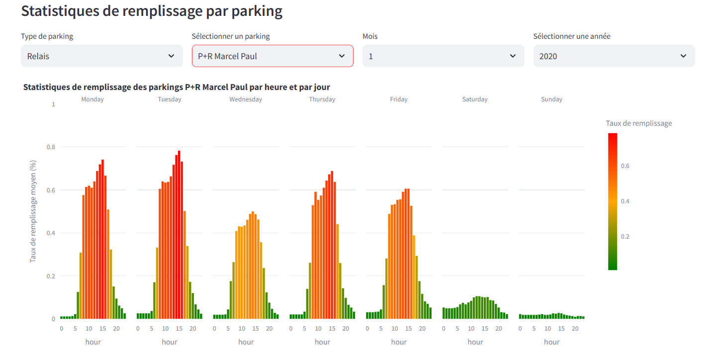

# WCS-Projet3-Analyse-Parkings
## contexte 

## Source de données nantes : 
Les données utilisées pour ce projet proviennent du [source](https://data.nantesmetropole.fr/)

## Notebook Google Colab
Ce projet fait partie du parcours IA proposé par Wilde Code school.  
[Consulter le nootebook du projet](https://colab.research.google.com/drive/1_tEjbVNccAgrCCXBoZPOp488U8sX6TKq?usp=sharing)
[Consulter le rapport du projet](https://colab.research.google.com/drive/1gpRzYzrlMeoCRoz5Mh8eJ30ysy_uM2Q5?usp=sharing)
 
## Dashboard 
 Voici un aperçu du tableau de bord développé via streamlit :

  

  
  
  

